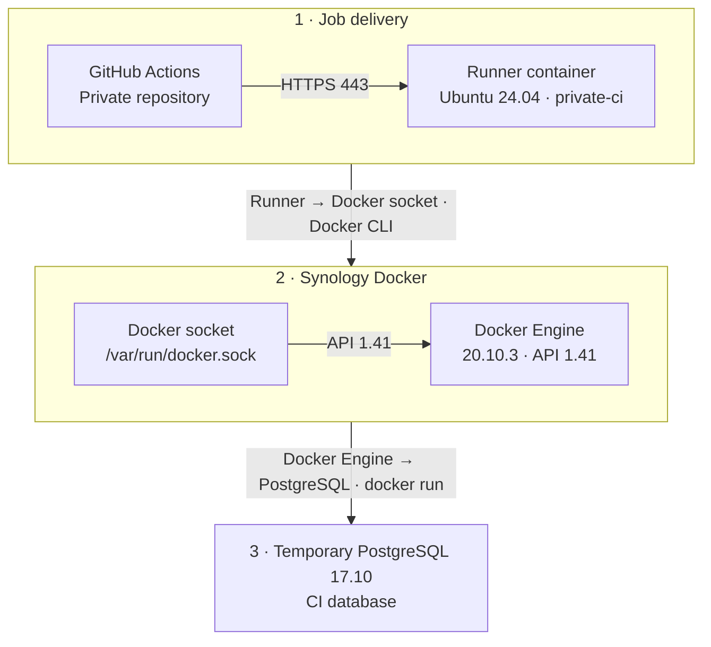

GitHub Actions 무료 2,000분을 모두 사용해서, Synology NAS의 Docker 컨테이너 안에 Self-hosted Runner를 만들었다. 최종적으로는 Runner 컨테이너에서 NAS Docker socket을 사용하고, PostgreSQL CI는 `services:` 대신 `docker run`으로 직접 띄우는 방식으로 검증했다.

## 최종 구조



Runner는 외부 요청을 받는 서버가 아니다. GitHub로 outbound HTTPS 443 연결을 만들고 작업을 받아온다. 그래서 NAS에 별도 포트 매핑이나 공유기 포트포워딩은 필요하지 않았다.

## 환경

| 항목 | 값 |
| --- | --- |
| 저장소 | GitHub 개인 비공개 저장소 |
| NAS CPU | Intel Pentium Silver J5040 |
| 아키텍처 | x86_64 |
| 컨테이너 OS | Ubuntu 24.04 |
| GitHub Actions Runner | 2.336.0 |
| Runner 이름 예시 | `ubuntu-private-runner-v2` |
| 전용 라벨 예시 | `private-ci` |
| 컨테이너 Docker CLI | 29.1.3 |
| Synology Docker Engine | 20.10.3 |
| Synology Docker API | 최대 1.41 |

이번 러너는 개인 저장소 단위로 등록했다. A 저장소에 붙인 러너는 A 저장소용이다. 다른 비공개 저장소에도 쓰려면 저장소별 러너 컨테이너를 따로 두는 편이 관리하기 쉽다.

워크플로에서는 전용 라벨로 러너를 지정한다.

```yaml
runs-on: [self-hosted, private-ci]
```

## 최종 컨테이너 설정

최종적으로 중요한 설정은 아래 명령에 모두 들어 있다.

### NAS 호스트에서 실행

```bash
docker run -d \
  --name github-runner-private-v2 \
  --restart unless-stopped \
  --user runner \
  --group-add "${SOCKET_GID}" \
  --workdir /actions-runner \
  -e DOCKER_API_VERSION=1.41 \
  -v github-runner-private-v2:/actions-runner \
  -v /var/run/docker.sock:/var/run/docker.sock \
  private-actions-runner:2.336.0-ubuntu24.04 \
  ./run.sh
```

| 옵션 | 필요한 이유 |
| --- | --- |
| `--restart unless-stopped` | NAS 재시작 후에도 러너를 자동 실행한다. |
| `--user runner` | 러너를 root가 아닌 일반 사용자로 실행한다. |
| `--group-add "${SOCKET_GID}"` | 일반 사용자가 Docker socket에 접근하게 한다. |
| `--workdir /actions-runner` | 러너 실행 위치를 고정한다. |
| `-e DOCKER_API_VERSION=1.41` | Synology Docker API 버전에 맞춘다. |
| `-v github-runner-private-v2:/actions-runner` | 러너 등록 정보와 업데이트 파일을 영구 저장한다. |
| `-v /var/run/docker.sock:/var/run/docker.sock` | NAS Docker Engine을 사용한다. |
| `./run.sh` | Runner listener를 실행한다. |

## 설치 순서

### 1. 볼륨 생성

러너 파일은 컨테이너 안이 아니라 영구 볼륨에 둬야 한다.

```bash
docker volume create github-runner-private-v2
```

### 2. Docker socket GID 확인

```bash
ls -n /var/run/docker.sock
SOCKET_GID=<DOCKER_SOCKET_GID>
```

이 값을 최종 컨테이너의 `--group-add "${SOCKET_GID}"`에 넣는다.

### 3. 설치용 컨테이너 실행

처음부터 `--user runner`로 실행하면 패키지 설치가 불편하다. 설치 단계에서는 root로 들어갈 수 있는 컨테이너를 따로 만들었다.

```bash
docker run -dit \
  --name github-runner-private-v2-setup \
  --workdir /actions-runner \
  -v github-runner-private-v2:/actions-runner \
  -v /var/run/docker.sock:/var/run/docker.sock \
  -e DOCKER_API_VERSION=1.41 \
  ubuntu:24.04 \
  bash
```

### 4. 패키지와 Docker CLI 설치

아래 명령은 Runner 컨테이너 내부에서 실행한다.

```bash
apt-get update
apt-get install -y \
  curl ca-certificates tar gzip sudo git jq iproute2 \
  postgresql-client libicu74 libicu-dev
```

Ubuntu 24.04에서는 `libicu74`, `libicu-dev`가 필요했다. 없으면 Runner 실행 중 다음 오류가 발생할 수 있다.

```text
Libicu's dependencies is missing for Dotnet Core 6.0
```

Docker socket을 마운트해도 컨테이너 안에 Docker CLI가 없으면 `docker` 명령을 쓸 수 없다. 그래서 Docker CLI만 설치했다. Docker daemon은 NAS에 있는 것을 사용한다.

```bash
install -m 0755 -d /etc/apt/keyrings
curl -fsSL https://download.docker.com/linux/ubuntu/gpg \
  -o /etc/apt/keyrings/docker.asc
chmod a+r /etc/apt/keyrings/docker.asc

echo "deb [arch=$(dpkg --print-architecture) signed-by=/etc/apt/keyrings/docker.asc] https://download.docker.com/linux/ubuntu noble stable" \
  > /etc/apt/sources.list.d/docker.list

apt-get update
apt-get install -y docker-ce-cli
docker version --format '{{.Client.Version}}'
```

### 5. runner 사용자 생성

`config.sh`와 `run.sh`는 root로 실행하면 안 된다.

```bash
useradd -m -s /bin/bash runner
chown -R runner:runner /actions-runner
```

실행 권한 기준은 이렇게 나눴다.

| 작업 | 사용자 |
| --- | --- |
| 패키지 설치 | root |
| `./bin/installdependencies.sh` | root |
| `./config.sh` | runner |
| `./run.sh` | runner |

### 6. Runner 다운로드와 등록

아래 명령은 Runner 컨테이너 내부에서 실행한다.

```bash
cd /actions-runner

curl -o actions-runner-linux-x64-2.336.0.tar.gz -L \
  https://github.com/actions/runner/releases/download/v2.336.0/actions-runner-linux-x64-2.336.0.tar.gz

tar xzf actions-runner-linux-x64-2.336.0.tar.gz
chown -R runner:runner /actions-runner

./bin/installdependencies.sh
```

등록은 `runner` 사용자로 전환해서 진행한다.

```bash
su - runner
cd /actions-runner

./config.sh \
  --url https://github.com/<OWNER>/<REPOSITORY> \
  --token <ONE_TIME_RUNNER_TOKEN> \
  --name ubuntu-private-runner-v2 \
  --labels private-ci \
  --work _work \
  --unattended
```

등록 후 `/actions-runner`에 `.runner`, `.credentials`, `_work`가 생겼는지 확인한다.

```bash
ls -la /actions-runner
```

### 7. 이미지 저장 후 최종 실행

이번에는 빠르게 복구하기 위해 설치 컨테이너를 이미지로 저장했다.

```bash
docker stop github-runner-private-v2-setup
docker commit github-runner-private-v2-setup private-actions-runner:2.336.0-ubuntu24.04
```

이후 앞에서 정리한 최종 `docker run` 명령으로 실행했다. 다만 `docker commit`은 임시 해결에 가깝다. 나중에는 Dockerfile로 재현 가능하게 만드는 것이 맞다.

## 실패한 접근

처음에는 Ubuntu 컨테이너 루트에서 러너를 풀고 실행했다.

```bash
docker run -dit --name github-runner-private ubuntu:24.04 bash
```

이후 `/actions-runner` 볼륨을 연결했지만 비어 있었다. 이유는 러너가 `/actions-runner`가 아니라 컨테이너 루트 파일시스템에 설치됐기 때문이다.

확인은 이렇게 했다.

```bash
docker exec github-runner-private sh -lc 'ps -ef | grep Runner | grep -v grep'
docker exec github-runner-private sh -lc 'ls -la /actions-runner'
docker exec github-runner-private sh -lc 'readlink -f /proc/1/cwd'
```

실제 실행 파일은 `/bin/Runner.Listener`, 실행 위치는 `/`였다. 그래서 기존 러너를 바로 지우지 않고, `ubuntu-private-runner-v2`를 새로 병렬 구축했다. 새 러너가 online/idle, Docker, PostgreSQL까지 통과하기 전까지 기존 컨테이너는 백업으로 남겨두는 편이 안전했다.

## 오류별 해결

| 오류 | 원인 | 해결 |
| --- | --- | --- |
| `curl: command not found` | Ubuntu 기본 이미지에 `curl` 없음 | `apt-get install -y curl ca-certificates` |
| `Must not run with sudo` | `config.sh`, `run.sh`를 root로 실행 | `runner` 일반 사용자로 실행 |
| `Libicu's dependencies is missing for Dotnet Core 6.0` | Runner의 .NET 의존성 부족 | `libicu74`, `libicu-dev` 설치 |
| `docker: command not found` | 컨테이너 내부에 Docker CLI 없음 | `docker-ce-cli` 설치 |
| `/var/run/docker.sock: no such file or directory` | Docker socket 미마운트 | `-v /var/run/docker.sock:/var/run/docker.sock` |
| `client version 1.52 is too new. Maximum supported API version is 1.41` | Docker CLI와 Synology Docker API 버전 차이 | `DOCKER_API_VERSION=1.41` 설정 |
| `Container feature is not supported when runner is already running inside container` | Runner가 컨테이너 안에서 실행 중이라 `services:` 사용 불가 | PostgreSQL을 `docker run`으로 직접 실행 |

## Docker API 1.41 고정

컨테이너 내부 Docker CLI는 29.1.3이고 기본 API는 1.52였다. 반면 Synology Docker Engine 20.10.3은 API 1.41까지만 지원했다.

그래서 아래 설정이 필요했다.

```bash
DOCKER_API_VERSION=1.41
```

일시 확인은 이렇게 한다.

```bash
DOCKER_API_VERSION=1.41 docker version
DOCKER_API_VERSION=1.41 docker ps
```

영구 설정은 두 가지 방식이 있다.

```bash
echo 'DOCKER_API_VERSION=1.41' >> /actions-runner/.env
```

또는 컨테이너 실행 옵션에 넣는다.

```bash
-e DOCKER_API_VERSION=1.41
```

나는 컨테이너 옵션으로 고정했다. 환경변수는 이미 실행 중인 `run.sh`에 자동 반영되지 않으므로 설정 후 러너를 재시작해야 한다.

```bash
docker restart github-runner-private-v2
```

## PostgreSQL CI 대체

GitHub-hosted runner에서는 보통 `services.postgres`를 쓴다. 하지만 Runner 자체가 Docker 컨테이너 안에서 실행되면 `services:`를 그대로 사용할 수 없었다.

대신 workflow step에서 PostgreSQL 17.10 컨테이너를 직접 띄웠다.

```yaml
jobs:
  smoke:
    runs-on: [self-hosted, private-ci]
    env:
      POSTGRES_DB: app_test
      POSTGRES_USER: <POSTGRES_USER>
      POSTGRES_PASSWORD: <POSTGRES_PASSWORD>

    steps:
      - uses: actions/checkout@v4

      - name: Start PostgreSQL
        shell: bash
        run: |
          set -euo pipefail
          POSTGRES_CONTAINER="private-postgres-${GITHUB_RUN_ID}-${GITHUB_RUN_ATTEMPT}"
          echo "POSTGRES_CONTAINER=${POSTGRES_CONTAINER}" >> "$GITHUB_ENV"

          RUNNER_NETWORK="$(docker inspect "$(hostname)" \
            --format '{{range $name, $_ := .NetworkSettings.Networks}}{{$name}}{{end}}')"

          docker run -d \
            --name "$POSTGRES_CONTAINER" \
            --network "$RUNNER_NETWORK" \
            -e POSTGRES_DB="$POSTGRES_DB" \
            -e POSTGRES_USER="$POSTGRES_USER" \
            -e POSTGRES_PASSWORD="$POSTGRES_PASSWORD" \
            postgres:17.10

      - name: Wait and verify PostgreSQL
        shell: bash
        env:
          PGPASSWORD: ${{ env.POSTGRES_PASSWORD }}
        run: |
          set -euo pipefail
          POSTGRES_HOST="$(docker inspect "$POSTGRES_CONTAINER" \
            --format '{{range .NetworkSettings.Networks}}{{.IPAddress}}{{end}}')"

          for i in {1..30}; do
            if pg_isready -h "$POSTGRES_HOST" -p 5432 -U "$POSTGRES_USER"; then
              break
            fi
            sleep 1
          done

          nc -zv "$POSTGRES_HOST" 5432
          psql -h "$POSTGRES_HOST" -p 5432 -U "$POSTGRES_USER" -d "$POSTGRES_DB" -c 'SELECT 1;'

      - name: Cleanup PostgreSQL
        if: always()
        shell: bash
        run: |
          docker rm -f "$POSTGRES_CONTAINER" || true
```

컨테이너 이름에는 `GITHUB_RUN_ID`, `GITHUB_RUN_ATTEMPT`를 넣었다. 재실행이나 동시 실행 때 이름 충돌을 피하기 위해서다. 정리는 `if: always()`로 처리했다. 일반 셸 스크립트라면 `trap`을 써도 된다.

## 검증 결과

확인한 것은 다음이다.

- 새 Runner online/idle 확인
- Linux/X64 확인
- `private-ci` 라벨 확인
- 기본 셸 실행 통과
- Docker daemon 연결 통과
- Alpine 컨테이너 실행 통과
- PostgreSQL 17.10 실행 통과
- Runner와 PostgreSQL의 Docker 네트워크 연결 통과
- `SELECT 1` 통과
- 임시 PostgreSQL 컨테이너 자동 삭제 확인

임시 컨테이너가 남지 않았는지는 NAS 호스트에서 확인했다.

```bash
docker ps -a --filter "name=private-postgres-"
```

## 보안 주의

가장 조심해야 할 설정은 Docker socket 마운트다.

```bash
-v /var/run/docker.sock:/var/run/docker.sock
```

이 설정은 Runner 컨테이너가 NAS Docker 전체를 제어할 수 있다는 뜻이다. 사실상 root 수준 권한에 가깝다. 그래서 아래 기준을 지켜야 한다.

- 신뢰하는 비공개 저장소에서만 사용한다.
- 검토되지 않은 외부 PR을 자동 실행하지 않는다.
- NAS 개인 데이터 폴더를 Runner 컨테이너에 마운트하지 않는다.
- 토큰과 자격 증명을 이미지, Git, 로그에 넣지 않는다.
- 기존 컨테이너는 새 러너 검증 완료 전까지 백업으로 유지한다.

## 현재 상태

완료한 것은 NAS Runner 연결과 Docker/PostgreSQL 대체 방식 검증이다.

아직 완료하지 않은 것은 대상 프로젝트 메인 CI 워크플로의 self-hosted 전환이다.

- 메인 CI의 `runs-on`을 `private-ci`로 변경한다.
- PostgreSQL `services:`를 수동 `docker run` 방식으로 교체한다.
- 실패 시 PostgreSQL 로그를 확인할 수 있게 만든다.


## 참고 자료

- [GitHub Docs - GitHub Actions billing](https://docs.github.com/en/billing/concepts/product-billing/github-actions)
- [GitHub Docs - Adding self-hosted runners](https://docs.github.com/en/actions/how-tos/manage-runners/self-hosted-runners/add-runners)
- [GitHub Docs - Self-hosted runners reference](https://docs.github.com/en/actions/reference/runners/self-hosted-runners)
- [GitHub Docs - Workflow syntax for GitHub Actions](https://docs.github.com/en/actions/reference/workflows-and-actions/workflow-syntax)
- [Docker Docs - Docker CLI environment variables](https://docs.docker.com/reference/cli/docker/)
- [Docker Docs - Docker Engine API](https://docs.docker.com/reference/api/engine/)
- [Docker Docs - docker version](https://docs.docker.com/reference/cli/docker/version/)
- [Ubuntu Packages - libicu-dev in Ubuntu 24.04 noble](https://packages.ubuntu.com/noble/libicu-dev)
- [Synology Knowledge Center - Container Manager container](https://kb.synology.com/en-eu/DSM/help/ContainerManager/docker_container)
- [Synology Knowledge Center - Container Manager network](https://kb.synology.com/en-global/DSM/help/ContainerManager/docker_network)
