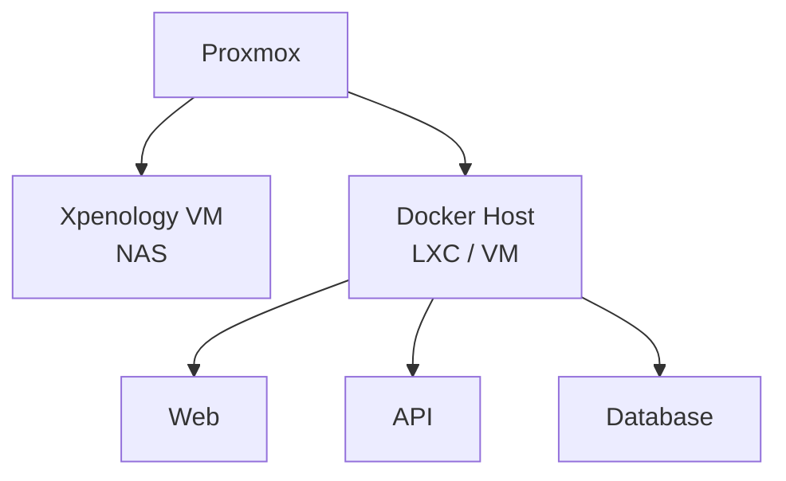

개인 프로젝트를 운영하면서 웹 서버, API 서버, 데이터베이스, Docker 컨테이너와 NAS를 한 대의 홈서버에서 운영해왔다.

처음에는 저전력 NAS 구성을 목표로 Intel J5040 기반 시스템에 헤놀로지를 설치하고, DSM 내부의 Docker로 여러 서비스를 실행했다. HDD 2개와 SSD 1개가 연결된 상태에서 아이들 소비전력이 약 19W였기 때문에 저전력이라는 측면에서는 만족스러운 구성이었다.

하지만 서비스를 하나씩 추가하면서 문제가 생기기 시작했다. 한 대의 서버가 단순한 NAS가 아니라 **개발 서버, 애플리케이션 서버, 데이터베이스, NAS** 역할을 모두 수행하고 있었다. 결국 성능, 발열을 못버티고 서버가 죽는 현상이 반복되었다. 그래서 업그레이드 사양을 결정하기 전에 먼저 서버의 목적과 구조를 다시 정의할 필요가 있었다.

## 변경 전후 요약

| 구분       | 기존 서버             | 새 서버                   |
| -------- | ----------------- | ---------------------- |
| CPU      | Intel J5040       | Ryzen 5 5600G          |
| 기반 환경    | Xpenology / DSM   | Proxmox                |
| 서비스 구조   | DSM 내부 Docker에 집중 | VM, LXC, Docker로 역할 분리 |
| 아이들 소비전력 | 약 19W             | 초기 측정 약 27W            |
| 우선순위     | 최소 소비전력           | 성능 여유, 장애 격리, 전력 효율    |

## 기존 서버 구성

기존 구성의 핵심은 다음과 같았다.

- Intel J5040 기반 ITX 시스템
- Xpenology / DSM
- DSM 내부 Docker
- HDD 2개
- SSD 1개
- 아이들 소비전력 약 19W

처음 서버를 만들 당시에는 NAS와 몇 개의 Docker 컨테이너만 실행할 생각이었다. J5040은 이런 용도로는 매력적인 CPU였다. 소비전력이 낮고 발열도 적기 때문이다.

문제는 서버가 담당하는 일이 점점 많아졌다는 것이다. 웹 서버, API 서버, MariaDB와 PostgreSQL 같은 데이터베이스, 개인 프로젝트용 컨테이너를 실행하면서 서버는 NAS보다 개발 서버에 가까워졌다.

## 문제 1. 부하가 시스템 전체 장애로 이어졌다

가장 큰 문제는 안정성이었다.

높은 부하가 발생하면서 시스템이 몇 차례 다운됐고, 이후에는 DSM 자체에 접근하지 못하는 상황도 발생했다. Docker 역시 DSM 내부에서 실행하고 있었기 때문에 DSM에 문제가 생기면 NAS뿐 아니라 애플리케이션 서버에도 동시에 접근할 수 없었다.

```text
Hardware
   ↓
Xpenology / DSM
   ↓
Docker
   ↓
Web / API / DB
```

NAS 운영체제가 사실상 모든 서비스의 기반이었다. DSM에 문제가 발생하면 그 위의 서비스도 모두 영향을 받는 구조였다.

이 경험을 통해 NAS와 애플리케이션 서버를 같은 레이어에 두는 방식은 관리하기 편하지만, 장애 격리 측면에서는 불리하다는 점을 체감했다.

## 문제 2. J5040의 성능 여유가 부족했다

J5040 자체가 나쁜 CPU는 아니다. NAS나 단순 파일 서버라면 충분히 사용할 수 있다. 하지만 내가 서버에 요구하는 역할은 이미 NAS 수준을 넘어섰다.

다음 작업이 동시에 발생할 수 있었다.

```text
NAS 파일 접근
+ Docker Web Server
+ API Server
+ MariaDB / PostgreSQL
+ 백그라운드 작업
+ 개발 테스트 환경
```

각 작업이 무겁지 않더라도 동시에 실행되면 CPU와 메모리 자원에 여유가 필요하다. 데이터베이스와 Docker 서비스를 계속 추가할 계획이었기 때문에 현재 부하만 처리하기보다 앞으로의 확장성을 확보하는 것이 중요하다고 판단했다.

## CPU 선택: Ryzen 5 5600G

새 서버 CPU를 선택할 때 세 가지 조건을 우선했다.

1. 충분한 멀티코어 성능
2. 낮은 아이들 소비전력
3. DDR4 기반의 저렴한 플랫폼

Intel N100과 N150 계열 같은 저전력 CPU도 검토했지만, 여러 서비스를 동시에 운영할 수 있는 성능 여유를 더 확보하고 싶었다. 그 결과 Ryzen 5 5600G를 선택했다.

5600G의 주요 장점은 다음과 같았다.

- 6코어 12스레드
- 내장 GPU
- DDR4 지원
- 비교적 낮은 중고 가격

단순 NAS만 만든다면 과한 CPU일 수 있다. 하지만 새 서버의 목표는 NAS가 아니라 **개인 인프라 서버**였다. J5040보다 CPU 자원에 여유가 있어 여러 서비스를 동시에 운영하기에 더 적합하다고 판단했다.

## 메인보드와 전력 설정

메인보드는 ASUS PRIME A520M-K를 사용했다. 고가의 서버용 메인보드보다 전체 시스템 가격과 소비전력을 줄이는 방향을 선택했다.

홈서버는 일반 데스크톱과 목적이 다르기 때문에 다음 BIOS 항목을 확인했다.

- CPU C-State
- DF C-State
- PCIe ASPM
- CPPC
- RAM Power Down
- CPU 전력 제한
- 저부하 상태의 전력 관리

5600G의 최대 성능을 항상 사용할 필요는 없어서 35W 수준의 CPU 전력 제한도 검토했다. 24시간 운영하는 서버에서는 짧은 순간의 최고 성능보다 장시간 안정적이고 효율적으로 동작하는지가 더 중요하기 때문이다.

## 아이들 소비전력은 19W에서 27W로 늘었다

새 시스템을 처음 구성했을 때 측정한 아이들 소비전력은 약 27W였다. 기존 J5040 시스템의 약 19W와 비교하면 8W 증가한 수치다.

처음에는 이 부분이 가장 고민됐다. 저전력 서버를 만들기 위해 업그레이드했지만 오히려 소비전력이 늘었기 때문이다. 그러나 전력만 단독으로 비교하는 것은 적절하지 않다고 판단했다.

기존 서버는 19W를 사용하면서 CPU 성능에 여유가 거의 없었다. 새 서버는 약간 더 많은 전력을 사용하지만 훨씬 큰 연산 여유를 확보했다.

따라서 목표를 다음과 같이 바꿨다.

```text
최소 소비전력
        ↓
필요한 성능을 확보한 상태에서의 최소 소비전력
```

이 기준의 변화가 이번 업그레이드에서 가장 크게 달라진 생각이었다.

## 운영체제와 서비스 구조 재설계

하드웨어보다 더 중요하게 생각한 것은 서버 구조였다. 기존에는 Xpenology가 모든 서비스의 중심이었다. 새 서버에서는 Proxmox를 기반으로 역할을 분리하는 방향으로 구성했다.



핵심은 **NAS와 애플리케이션 서버를 분리하는 것**이다.

## Proxmox를 선택한 이유

Ubuntu나 Debian을 직접 설치하고 Docker만 사용하는 방법도 검토했다. 구조가 단순하고 가상화 오버헤드가 적다는 장점이 있다.

그럼에도 Proxmox를 선택한 가장 큰 이유는 서비스 격리였다. NAS에 문제가 생겨도 Docker 서버가 반드시 함께 중단될 필요는 없다. 반대로 Docker 환경을 잘못 설정하더라도 NAS 데이터를 직접 건드리지 않도록 구성할 수 있다.

VM이나 LXC 단위로 다음 작업을 수행할 수 있다는 점도 장점이었다.

- 재부팅
- 백업
- 스냅샷
- 자원 제한
- 테스트 환경 생성

개발 과정에서 새로운 서비스를 시험할 일이 많기 때문에 환경을 분리하고 되돌릴 수 있는 기능이 유용하다고 판단했다.

## VM, LXC, Docker의 역할 구분

Proxmox를 공부하면서 VM과 LXC를 같은 용도로 사용하지 않기로 했다.

VM은 독립된 커널을 포함해 격리 수준이 높지만 그만큼 오버헤드가 있다. 반면 LXC는 호스트 커널을 공유하기 때문에 더 가볍다. 일반적인 애플리케이션은 그 위에서 Docker 컨테이너로 분리할 수 있다.

현재 계획한 역할은 다음과 같다.

| 워크로드 | 실행 환경 |
| --- | --- |
| Xpenology | VM |
| Docker Host | LXC |
| 일반 Web / API | Docker 컨테이너 |
| Database | Docker 또는 별도 LXC |
| OS 단위 테스트 환경 | VM |

모든 서비스를 VM으로 만드는 대신 필요한 격리 수준과 자원 사용량에 따라 VM, LXC, Docker를 나누는 방식이다. 데이터베이스 배치는 아직 Docker와 별도 LXC 중에서 검토하고 있다.

## 스토리지 역할도 다시 나눴다

보유한 저장장치는 다음과 같았다.

- SK hynix Gold P31 NVMe 1TB
- Micron SATA SSD 500GB
- Samsung SATA SSD 256GB
- WD Red HDD 4TB
- HDD 500GB

기존에는 디스크를 단순한 저장 공간으로 생각했다. 하지만 가상화를 적용하면서 디스크에도 역할을 나눌 필요가 생겼다.

```text
Proxmox OS
VM / LXC
Docker 데이터
Database
NAS 데이터
백업
```

각 워크로드는 접근 패턴이 다르다. NAS용 HDD에는 대용량 데이터를 저장하고, VM이나 Docker처럼 랜덤 I/O가 많은 작업에는 SSD를 사용하는 식으로 역할을 분리하는 편이 효율적이다.

Proxmox 자체를 대용량 SSD에 설치하면 공간을 충분히 활용하지 못할 수 있다. 그래서 작은 SSD를 시스템용으로 사용하고, 상대적으로 빠르고 큰 SSD를 VM이나 컨테이너 데이터에 배치하는 방향을 검토했다.

이 과정에서 스토리지는 단순히 어디에 파일을 저장할 것인가가 아니라, **각 워크로드의 I/O 특성에 어떤 저장장치를 배치할 것인가**의 문제라는 점을 배웠다.

## 저전력 서버에서 CPU보다 중요한 요소

처음에는 저전력 CPU를 사용하면 저전력 서버가 된다고 생각했다. 직접 소비전력을 측정하면서 생각이 바뀌었다.

아이들 상태에서는 다음 부품과 설정도 전체 소비전력에 영향을 준다.

- 메인보드
- PSU 저부하 효율
- RAM
- NVMe SSD
- SATA Controller
- LAN Controller
- HDD 회전 상태
- PCIe ASPM 설정

CPU 사용률이 거의 0%일 때는 CPU의 TDP보다 각 장치가 얼마나 깊은 절전 상태에 들어갈 수 있는지가 더 중요했다. 그래서 C-State와 ASPM 같은 전력 관리 기능을 살펴보기 시작했다.

### C-State

CPU가 일을 하지 않을 때 일부 회로나 코어를 더 깊은 절전 상태로 보내는 기능이다. 일반적으로 더 깊은 C-State에 들어갈수록 소비전력은 줄지만 다시 활성화되는 데 약간의 시간이 필요하다.

대부분의 시간을 아이들 상태로 보내는 24시간 홈서버에서는 중요한 기능이다.

### ASPM

ASPM은 PCI Express 링크의 전력 관리 기능이다. CPU가 쉬고 있어도 PCIe 장치가 계속 활성 상태라면 시스템 전체 소비전력이 충분히 내려가지 않을 수 있다.

다만 메인보드마다 BIOS에서 제공하는 설정 범위가 달랐다. ASUS PRIME A520M-K에서도 일부 PCIe ASPM 설정과 DF C-State를 확인할 수 있었지만 모든 장치를 세세하게 제어할 수 있는 것은 아니었다.

같은 CPU를 사용하더라도 메인보드와 BIOS에 따라 홈서버의 아이들 소비전력이 달라질 수 있다는 점을 알게 됐다.

## 서버용 부품이 항상 정답은 아니었다

처음에는 서버를 만든다면 서버용 부품을 사용해야 한다고 생각했다. 하지만 홈서버에는 데이터센터 서버와 다른 기준이 필요했다.

데이터센터 서버는 높은 부하, 다중 사용자, 원격 관리, ECC, 이중화가 중요하다. 반면 개인 홈서버에서는 아이들 소비전력, 가격, 소음, 유지보수 편의성과 적당한 성능이 더 중요할 수 있다.

이번 시스템에서는 일반 소비자용 Ryzen 플랫폼을 사용하고, 소프트웨어 구조를 통해 서비스 격리와 복구 편의성을 확보하는 방향을 선택했다.

## 가장 중요한 변화는 CPU가 아니었다

처음에는 J5040에서 Ryzen 5 5600G로 CPU를 바꾸는 것이 이번 업그레이드의 핵심이라고 생각했다. 지금 돌아보면 CPU보다 더 중요한 변화는 서버를 바라보는 방식이었다.

기존에는 한 대의 컴퓨터에서 모든 서비스를 실행한다는 생각에 가까웠다. 지금은 하드웨어 자원을 여러 개의 독립된 서비스 환경에 나눠 제공하는 방향으로 생각하고 있다.

Proxmox, VM, LXC, Docker를 구분해서 사용하기 시작한 것도 이 때문이다. 물리 하드웨어는 한 대지만 논리적으로는 여러 서버처럼 운영할 수 있다.

## 장애를 겪으며 배운 점

이번 업그레이드의 시작은 성능 부족보다 장애였다. 기존 서버가 계속 안정적으로 동작했다면 구조를 이 정도까지 바꾸지 않았을 가능성이 높다.

### 1. 동작하는 것과 안정적인 것은 다르다

서비스가 현재 정상적으로 실행되고 있다고 해서 좋은 구조인 것은 아니다. 장애가 발생했을 때 영향 범위를 파악하고 복구할 수 있어야 한다.

### 2. 서비스 사이의 장애 범위를 분리해야 한다

docker로 올린 서비스들 문제 때문에 NAS 서버까지 사용할 수 없어지는 구조는 가능하면 피해야 한다.

### 3. 리소스에는 여유가 필요하다

평균 CPU 사용률이 낮더라도 순간적인 부하를 처리할 여유가 없다면 서버 전체가 불안정해질 수 있다.

### 4. 홈서버에도 아키텍처가 필요하다

사용자가 한 명인 개인 서버라도 서비스가 많아지면 작은 인프라가 된다. 모든 것을 직접 관리해야 하므로 역할과 장애 범위를 단순하고 명확하게 유지하는 것이 중요했다.

## 현재 목표와 다음 작업

새 서버의 목표는 단순한 NAS가 아니다. 다음 역할을 하나의 개인 인프라 안에서 분리해 운영하는 것이 목표다.

```text
Home Server
├── NAS
├── Docker
│   ├── Web Server
│   ├── API Server
│   └── Personal Projects
├── Database
│   ├── MariaDB
│   └── PostgreSQL
├── Development Environment
└── Backup
```

동시에 필요한 성능과 안정성을 확보한 뒤 불필요한 전력 소비를 줄이려고 한다.

앞으로 확인할 작업은 다음과 같다.

- Proxmox의 VM과 LXC 배치 확정
- Docker 서비스 이전과 자원 제한
- 데이터베이스 실행 환경 결정
- HDD 절전 정책 적용
- ASPM과 CPU C-State 최적화
- 설정별 실제 소비전력 측정

다음 글에서는 각 설정을 바꿨을 때 소비전력이 실제로 얼마나 달라지는지 기록할 예정이다.

## 마무리

이번 업그레이드는 J5040이 느리니 더 빠른 CPU로 바꾸자는 생각에서 시작했다. 하지만 실제 서버를 다시 구성하면서 서비스 격리, 가상화, 스토리지 I/O, 장애 복구, 전력 관리까지 함께 고민하게 됐다.

특히 서버 장애 경험은 단순한 하드웨어 교체를 **인프라 구조를 다시 설계하는 경험**으로 바꿨다.

현재 아이들 소비전력은 기존 J5040 시스템보다 높다. 이제는 가장 낮은 전력 자체를 목표로 하지 않는다. 필요한 성능과 안정성을 확보한 뒤 불필요한 전력 소비를 최대한 줄이는 것이 현재 생각하는 좋은 홈서버의 기준이다.
